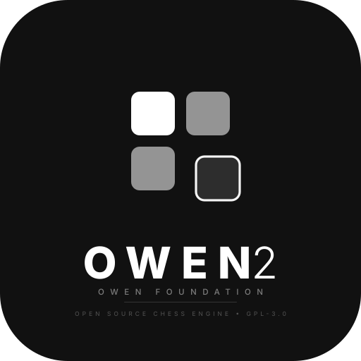

<p align="center">
  
</p>

# Owen 2 — Open-Source Chess Engine (GPL-3.0) — by [Owen Foundation](https://github.com/Owen-Foundation)

> **From-scratch UCI engine** — bitboards, NNUE (`HalfKP+Threat`), and **Marrow Tree Search (MTS)**, a best-first search alternative to alpha-beta.

```
o2 > uci
id name Owen 2
id author Owen Foundation
uciok
```

---

## Why Owen 2

Stockfish is dominant because of a highly tuned alpha-beta search plus NNUE. Owen 2 keeps the lesson (NNUE is excellent) but replaces the search with something original: **Marrow Tree Search (MTS)**.

| Classical search pain point | MTS approach |
|---|---|
| Horizon effect & single-PV tunnel vision | Multi-PV aware frontier; uncertainty-guided expansion |
| Null-move / LMR fragility on zugzwang & tactics | Proof-guided selective deepening, no null-move |
| History-heuristic myopia | Separate policy/value signals + UCB-style exploration |
| Transposition table pollution | Age + bound-aware replacement, per-thread sharding |

No Stockfish code is included. Evaluation, search, and move ordering are original. The NNUE architecture follows public literature, not Stockfish sources.

## Architecture

```
src/
  types.h, bitboard.h/.cpp  — attack tables, magic bitboards
  position.h/.cpp           — board state, make/unmake, Zobrist, FEN
  movegen.h/.cpp            — pseudo-legal + legal generation, perft
  nnue/                     — HalfKP feature transformer + affine layers
  search/                   — Marrow Tree Search (selection / expansion / backup)
  uci.h/.cpp                — UCI loop, options
trainer/                    — Python/PyTorch trainer (sdata → .o2nn)
nets/                       — versioned network files (*.o2nn, not .nnue)
tests/                      — perft, see, eval, search correctness
```

## Quick Start

```bash
cmake -S . -B build -DCMAKE_BUILD_TYPE=Release
cmake --build build -j
./build/owen2                  # UCI REPL
./build/owen2-perft            # perft verification (Kiwipete 97862)
```

## UCI Options

| name | type | default | notes |
|---|---|---|---|
| Hash | spin | 64 | TT size in MB |
| Threads | spin | 1 | search threads |
| NNUEFile | string | `nets/o2-v1.o2nn` | network path |
| MTS_C | string | 1.35 | UCB exploration constant |
| MTS_MultiPV | spin | 1 | keep N PVs alive |

## Training

Generate data:

```bash
./build/owen2-sdata --games 100000 --out data/sdata.bin
```

Train a net:

```bash
python trainer/train.py --sdata data/sdata.bin --out nets/o2-v1.o2nn --device cuda
# --device cuda | mps | cpu
```

See [trainer/README.md](trainer/README.md) for format details. For distillation from Stockfish, see [DISTILL.md](DISTILL.md).

## Marrow Tree Search — Sketch

MTS is a **best-first, proof-guided tree search** with NNUE leaves.

- **Selection**: UCB1 over sorted children (`Q + C·√(log N / n)`). Unvisited children are expanded eagerly.
- **Expansion**: one legal move → one child; priors from TT move / captures / promos (softmax).
- **Backup**: negamax value plus proof-urgency propagation.
- **No null-move, no classic LMR** — depth is allocated by uncertainty.

See [docs/mts.md](docs/mts.md) for the full spec.

## Legal

- License: **GPL-3.0-only** — see [LICENSE](LICENSE).
- No Stockfish source is included or derived from.
- Weights you train (`nets/*.o2nn`) are your data; the engine that loads them remains GPL-3.0.

## Contributing

See [CONTRIBUTING.md](CONTRIBUTING.md). Run `ctest --test-dir build` before pushing — perft must stay green.

## Acknowledgements

Thanks to the Stockfish, Leela Chess Zero, and CPW communities for public research that makes open chess engines possible.
